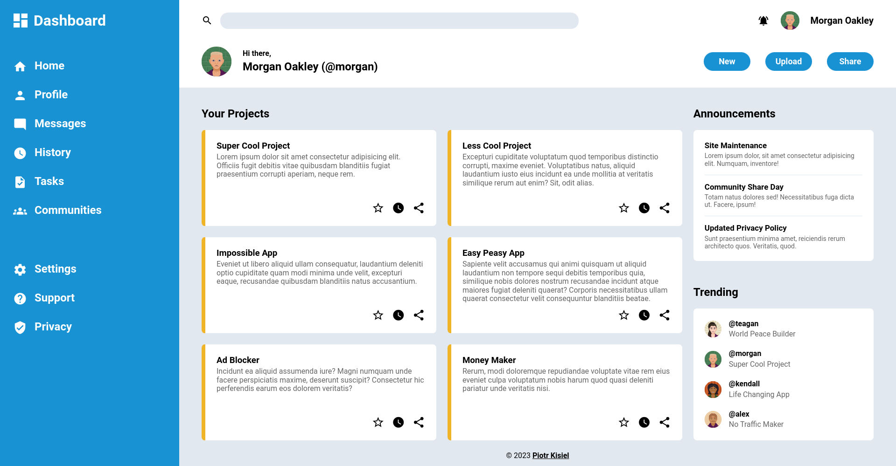

# admin-dashboard

This is a solution to the [Admin dashboard project](https://www.theodinproject.com/lessons/node-path-intermediate-html-and-css-admin-dashboard) from [The Odin Project](https://www.theodinproject.com).

# [Live view](https://pietyr.github.io/admin-dashboard/)

## Table of contents

-   [Overview](#overview)
    -   [The challenge](#the-challenge)
        -   [Design](#design)
    -   [Screenshot](#screenshot)
        -   [Desktop view](#desktop-view)
-   [My process](#my-process)
    -   [Built with](#built-with)
    -   [What I learned](#what-i-learned)
-   [Author](#author)

## Overview

### The challenge

The challenge is to build an admin dashboard design using CSS Grid.

#### Design

### Screenshot

## My process

### Built with

-   Semantic HTML5 markup
-   CSS custom properties
-   CSS Grid
-   Flexbox

### What I learned

-   CSS Grid

## Author

-   Piotr Kisiel
-   Github - [pietyr](https://github.com/pietyr)
